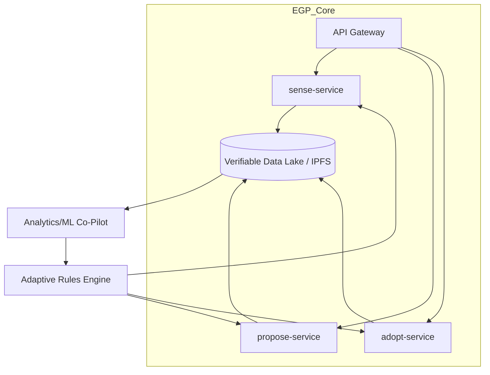

# The Emergent Governance Protocol (EGP)

[](https://github.com/ggf/egp)
[](https://creativecommons.org/licenses/by-sa/4.0/)
[](https://discord.gg/MjnzCfh4mM)

**The Minimum Viable Grammar for a Regenerative Civilization.**

The Emergent Governance Protocol (EGP) is a simple, powerful, and interoperable set of rules for bottom-up governance. It is a core technical component of the **[Global Governance Frameworks (GGF)](https://globalgovernanceframeworks.org/)** ecosystem, designed to enable communities, organizations, and even AI to coordinate effectively without central control.

We are not building a new platform to rule them all. We are building the universal grammar that allows all forms of governance to speak to each other. We are building this like **Wikipedia, not Uber**: open, collaborative, and for the common good.

---

## 🏛️ The Core Concept: Governance in 3 Verbs

EGP reduces the complexity of governance to three simple, universal "system calls":

1.  **🔍 `sense(issue)`**: Anyone, anywhere—a farmer, a sensor, an AI—can flag a systemic stressor or opportunity using a standardized data format.
2.  **💡 `propose(solution)`**: Anyone can suggest a response to a `sense` signal, complete with test criteria and a built-in expiration date (a "sunset clause").
3.  **⚡ `adopt(experiment)`**: A community or institution can choose to temporarily implement a proposal as a time-bound, measurable experiment.

This simple loop creates a living, adaptive system where the best solutions can emerge, spread, and evolve based on real-world results.

---

## 🚀 Technical Vision: Kubernetes for Governance

The EGP stack is a decentralized, modular, and open-source system designed for resilience and longevity. This vision, first proposed by DeepSeek, treats governance actions as verifiable, content-addressed data that flows through a network of interoperable services.



| Layer | Technology | Purpose |
|---|---|---|
| **Data Standard** | JSON Schema + **IPLD** | Immutable, content-addressed governance actions |
| **APIs** | **GraphQL** + WebSub | Real-time subscriptions to governance events |
| **Identity** | **DID** + **UCAN** | Self-sovereign identity and decentralized permissions |
| **Execution** | **WASM** Modules | Portable, sandboxed policy logic (e.g., sunset checks) |

-----

## ✨ Key Features

  * **🌐 Decentralized by Default**: No central server, no single point of failure. EGP nodes can run on anything from a Raspberry Pi to a cloud server.
  * **🔗 Radically Interoperable**: A universal data standard means any EGP-compliant tool can talk to any other.
  * **🔗 Offline-First**: Designed to work in remote communities with intermittent connectivity, syncing when a connection is available.
  * **🌱 Community-Owned & Governed**: The protocol itself is a digital commons, governed by its users.
  * **🤖 AI Co-Pilot**: An integrated AI helps detect patterns, suggest proposals, and flag conflicts, but all decisions remain in human hands.
  * **🔒 Verifiable & Secure**: Using decentralized identifiers and content-addressed storage, all governance actions are transparent, tamper-proof, and attributable.

-----

## 🛠️ Getting Started

We are in the early stages of development. The first step is defining the core data schemas.

1.  **Explore the Protocol:**

      * Read the **[full EGP Framework document](https://www.globalgovernanceframeworks.org/frameworks/emergent-governance-protocol)**.
      * Check out the **[technical implementation appendix](https://globalgovernanceframeworks.org/frameworks/emergent-governance-protocol#egp-appendix)**.

2.  **Join the Conversation:**

      * Join our **[Discord server](https://discord.gg/MjnzCfh4mM)** to meet the community and discuss the technical vision.
      * Introduce yourself in the `#introductions` channel.

3.  **Make Your First Contribution:**

      * The core schemas are the first piece of the puzzle. You can contribute by reviewing the proposed schemas and suggesting improvements.
      * Check out the **[open issues](https://github.com/GlobalGovernanceFrameworks/egp/issues)**, especially those tagged with `good first issue`.

```bash
# Example: Clone the schema repository and get started
git clone [https://github.com/ggf/egp.git](https://github.com/ggf/egp.git)
cd egp

# Explore the proposed data schemas (coming soon)
ls schemas/

# Run the local test suite (coming soon)
npm install
npm test
```

-----

## 🤝 How to Contribute

This is an open, collaborative project. We need thinkers and builders of all kinds:

  * **Rust / Go / TypeScript Developers**: To build the core services and nodes.
  * **UI/UX Designers**: To design intuitive, accessible interfaces for interacting with the protocol.
  * **Governance Theorists**: To help refine the logic and principles of the protocol.
  * **Community Organizers**: To help us pilot the EGP in real-world communities.

Please read our **[Contribution Guidelines](CONTRIBUTING.md)** to get started.

-----

## 📜 License

The Emergent Governance Protocol is licensed under the **Creative Commons Attribution-ShareAlike 4.0 International License ([CC BY-SA 4.0](https://creativecommons.org/licenses/by-sa/4.0/))**. You are free to share and adapt this work, even for commercial purposes, as long as you give appropriate credit and share your adaptations under the same license.
