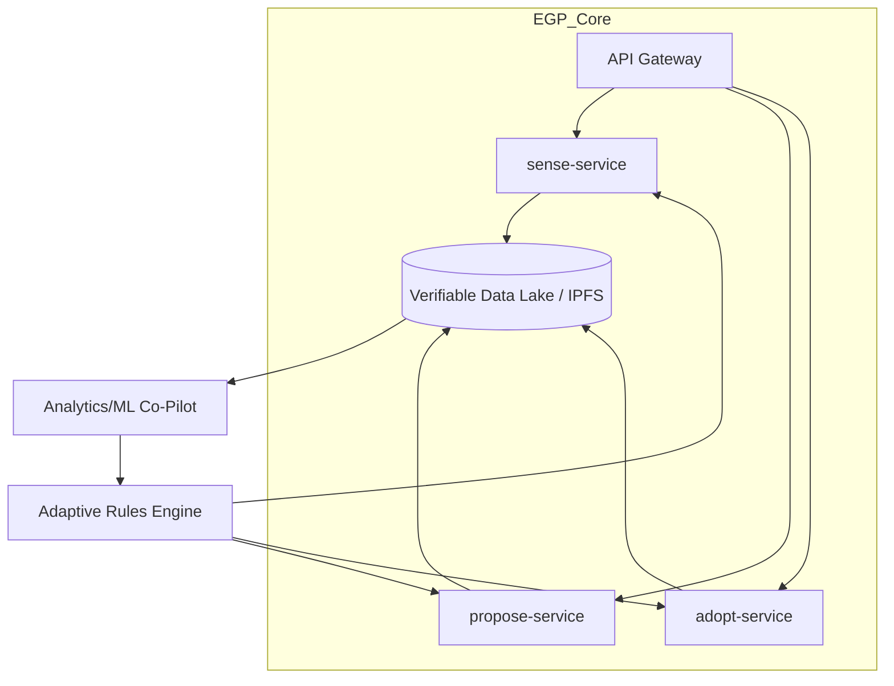

# The Emergent Governance Protocol (EGP)

[](https://github.com/ggf/egp)
[](https://creativecommons.org/licenses/by-sa/4.0/)
[](https://discord.gg/MjnzCfh4mM)

**The Minimum Viable Grammar for a Regenerative Civilization.**

The Emergent Governance Protocol (EGP) is a simple, powerful, and interoperable set of rules for bottom-up governance. It is a core technical component of the **[Global Governance Frameworks (GGF)](https://globalgovernanceframeworks.org/)** ecosystem, designed to enable communities, organizations, and even AI to coordinate effectively without central control.

We are not building a new platform to rule them all. We are building the universal grammar that allows all forms of governance to speak to each other. We are building this like **Wikipedia, not Uber**: open, collaborative, and for the common good.

---

## 🏛️ The Core Concept: Governance in 3 Verbs

EGP reduces the complexity of governance to three simple, universal "system calls":

1.  **🔍 `sense(issue)`**: Anyone, anywhere—a farmer, a sensor, an AI—can flag a systemic stressor or opportunity using a standardized data format.
2.  **💡 `propose(solution)`**: Anyone can suggest a response to a `sense` signal, complete with test criteria and a built-in expiration date (a "sunset clause").
3.  **⚡ `adopt(experiment)`**: A community or institution can choose to temporarily implement a proposal as a time-bound, measurable experiment.

This simple loop creates a living, adaptive system where the best solutions can emerge, spread, and evolve based on real-world results.

---

## 🚀 Technical Vision: Kubernetes for Governance

The EGP stack is a decentralized, modular, and open-source system designed for resilience and longevity. This vision, first proposed by DeepSeek, treats governance actions as verifiable, content-addressed data that flows through a network of interoperable services.



| Layer | Technology | Purpose |
|---|---|---|
| **Data Standard** | JSON Schema + **IPLD** | Immutable, content-addressed governance actions |
| **APIs** | **GraphQL** + WebSub | Real-time subscriptions to governance events |
| **Identity** | **DID** + **UCAN** | Self-sovereign identity and decentralized permissions |
| **Execution** | **WASM** Modules | Portable, sandboxed policy logic (e.g., sunset checks) |

-----

## ✨ Key Features

  * **🌐 Decentralized by Default**: No central server, no single point of failure. EGP nodes can run on anything from a Raspberry Pi to a cloud server.
  * **🔗 Radically Interoperable**: A universal data standard means any EGP-compliant tool can talk to any other.
  * **🔗 Offline-First**: Designed to work in remote communities with intermittent connectivity, syncing when a connection is available.
  * **🌱 Community-Owned & Governed**: The protocol itself is a digital commons, governed by its users.
  * **🤖 AI Co-Pilot**: An integrated AI helps detect patterns, suggest proposals, and flag conflicts, but all decisions remain in human hands.
  * **🔒 Verifiable & Secure**: Using decentralized identifiers and content-addressed storage, all governance actions are transparent, tamper-proof, and attributable.

-----

## 🛠️ Getting Started

### Prerequisites

- **Docker & Docker Compose** (recommended for quick start)
- **Node.js 18+** (for local development)
- **Git** for cloning the repository

### Quick Start with Docker

The fastest way to get EGP running is with Docker:

```bash
# 1. Clone the repository
git clone https://github.com/ggf/egp.git
cd egp

# 2. Start the EGP services (node + IPFS)
docker-compose up

# This starts:
# - EGP Node on http://localhost:3000
# - IPFS node on http://localhost:5001 (API) and http://localhost:8080 (Gateway)
```

**Verify it's working:**
```bash
# Check EGP node health
curl http://localhost:3000/health

# Should return: {"status":"healthy", "timestamp":"...", ...}
```

### Run the Complete EGP Demo

Once the services are running, test the full governance workflow:

```bash
# In a new terminal window
cd examples/
chmod +x egp_hello_world.sh
./egp_hello_world.sh
```

This demonstrates a complete `sense() → propose() → adopt()` cycle using a real-world scenario: a community garden water crisis resolved through traditional Indigenous knowledge.

### Manual API Testing

You can also test individual endpoints:

```bash
# 1. Flag a systemic issue
curl -X POST http://localhost:3000/sense \
  -H "Content-Type: application/json" \
  -H "Authorization: Bearer did:key:test123" \
  -d @examples/sense.json

# 2. Propose a solution
curl -X POST http://localhost:3000/propose \
  -H "Content-Type: application/json" \
  -H "Authorization: Bearer did:key:test123" \
  -d @examples/propose.json

# 3. Adopt as time-bound experiment
curl -X POST http://localhost:3000/adopt \
  -H "Content-Type: application/json" \
  -H "Authorization: Bearer did:key:test123" \
  -d @examples/adopt.json
```

-----

## 🧪 Running Tests

The EGP codebase includes comprehensive test suites for all protocol operations:

```bash
# Install dependencies (if not using Docker)
npm install

# Run all tests
npm test

# Run tests in watch mode (for development)
npm run test:watch
```

**Test Coverage:**
- ✅ **sense.test.js** - Signal validation, data enrichment, related signal detection
- ✅ **propose.test.js** - Proposal validation, duration parsing, lifecycle management  
- ✅ **adopt.test.js** - Adoption validation, monitoring setup, revocation conditions, learning archives

**Example test output:**
```
 PASS  test/sense.test.js
 PASS  test/propose.test.js  
 PASS  test/adopt.test.js
Test Suites: 3 passed, 3 total
Tests:       26 passed, 26 total
```

-----

## 🔧 Development Setup

For those wanting to contribute to the core protocol:

### Local Development (without Docker)

```bash
# 1. Install dependencies
npm install

# 2. Set up environment
cp .env.example .env
# Edit .env with your IPFS and other configuration

# 3. Start IPFS daemon (requires IPFS installed locally)
ipfs daemon

# 4. Start the EGP node in development mode
npm run dev

# 5. Run tests
npm test
```

### Docker Development Environment

For development with hot reloading:

```bash
# Start development services with file watching
docker-compose --profile dev up

# This starts:
# - egp-node-dev with hot reload on http://localhost:3001
# - IPFS node
```

### Additional Development Commands

```bash
# Lint code
npm run lint

# Format code
npm run format

# Build Docker image manually
docker build -t egp-node .

# Run only tests in Docker
docker-compose --profile test run test
```

### Understanding the Example

The provided example demonstrates:
- **Cultural Integration**: Traditional Atacameño water management + modern efficiency
- **Multi-Modal Evidence**: Sensor data + elder knowledge + community impact
- **Ceremonial Decision-Making**: Elder council with spiritual validation
- **Time-Bound Experimentation**: 4-month trial with 2-week monitoring cycles
- **Knowledge Transmission**: Youth apprenticeships in traditional techniques

-----

## 🔧 Project Structure

```
egp/
├── src/
│   ├── index.js              # Main server entry point
│   ├── sense.js              # sense() endpoint handler
│   ├── propose.js            # propose() endpoint handler
│   ├── adopt.js              # adopt() endpoint handler
│   └── lib/
│       └── ipfs.js           # IPFS integration
├── test/
│   ├── sense.test.js         # sense() protocol tests
│   ├── propose.test.js       # propose() protocol tests
│   └── adopt.test.js         # adopt() protocol tests
├── docs/
│   ├── specs/
│   │   ├── openapi.yaml      # Main API specification
│   │   ├── sense.md          # Detailed sense() documentation
│   │   ├── propose.md        # Detailed propose() documentation
│   │   └── adopt.md          # Detailed adopt() documentation
│   └── ai-conversations/     # Development discussions
├── examples/
│   ├── sense.json           # Example sense() payload
│   ├── propose.json         # Example propose() payload
│   ├── adopt.json           # Example adopt() payload
│   └── egp_hello_world.sh   # Complete workflow demonstration
├── docker-compose.yml       # Multi-service Docker setup
├── Dockerfile               # EGP node container definition
├── package.json             # Node.js dependencies and scripts
├── jest.config.js           # Test configuration
├── README.md                # This file
├── CONTRIBUTING.md          # Contribution guidelines
└── CODE_OF_CONDUCT.md       # Community standards
```

-----

## 🚨 Troubleshooting

### Docker Issues

**Services won't start:**
```bash
# Force rebuild without cache
docker-compose build --no-cache
docker-compose up
```

**IPFS connection issues:**
```bash
# Check IPFS logs
docker-compose logs ipfs

# Restart IPFS service
docker-compose restart ipfs
```

**Port conflicts:**
```bash
# Check what's using the ports
lsof -i :3000
lsof -i :5001

# Stop conflicting services or change ports in docker-compose.yml
```

### Test Issues

**ES Module errors:**
```bash
# Ensure you're using Node.js 18+
node --version

# Check that package.json has "type": "module"
grep '"type"' package.json
```

**IPFS connection in tests:**
```bash
# Tests run against the actual IPFS node, ensure it's running
curl http://localhost:5001/api/v0/version
```

### Common Development Issues

**Hot reload not working:**
```bash
# Use the dev profile for file watching
docker-compose --profile dev up egp-node-dev
```

**Permission issues with Docker:**
```bash
# On Linux, you might need to add your user to the docker group
sudo usermod -aG docker $USER
# Then log out and log back in
```

-----

## 🤝 How to Contribute

This is an open, collaborative project. We need thinkers and builders of all kinds:

  * **Rust / Go / TypeScript Developers**: To build the core services and nodes.
  * **UI/UX Designers**: To design intuitive, accessible interfaces for interacting with the protocol.
  * **Governance Theorists**: To help refine the logic and principles of the protocol.
  * **Community Organizers**: To help us pilot the EGP in real-world communities.

Please read our **[Contribution Guidelines](CONTRIBUTING.md)** to get started.

-----

## 📜 License

The Emergent Governance Protocol is licensed under the **Creative Commons Attribution-ShareAlike 4.0 International License ([CC BY-SA 4.0](https://creativecommons.org/licenses/by-sa/4.0/))**. You are free to share and adapt this work, even for commercial purposes, as long as you give appropriate credit and share your adaptations under the same license.
