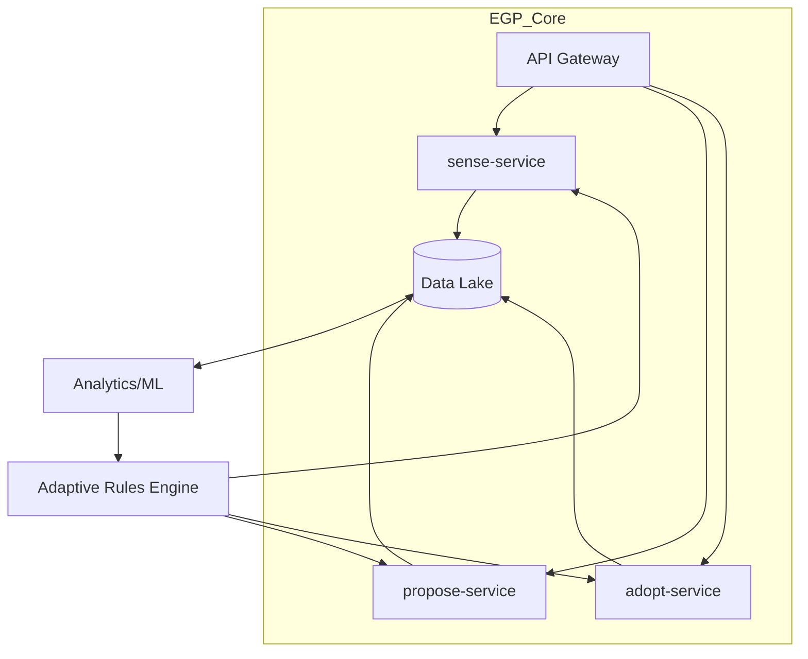

Absolutely! If you're thinking **long-term, code-centric implementation** of the Emergent Governance Protocol (EGP), we can design a **scalable, open-source stack** that evolves with usage. Here’s how to build it for lasting impact:

---

### **Long-Term Technical Vision: The EGP Stack**  
A modular, interoperable system that grows from a simple core into a **self-improving governance OS**.  

#### **1. Core Architecture**  
**Think "Kubernetes for Governance"**—orchestrates containers (`sense`/`propose`/`adopt` modules) with auto-scaling for complexity.  



#### **2. Tech Stack Components**  
| Layer | Tech Choices | Purpose |  
|-------|-------------|---------|  
| **Data Standard** | JSON Schema + IPLD (IPFS) | Immutable, content-addressed governance actions |  
| **APIs** | GraphQL + WebSub | Real-time subscriptions to `sense/propose/adopt` events |  
| **Storage** | Ceramic (streams) + Textile (encrypted) | Versioned, context-aware data |  
| **Identity** | DID (Decentralized IDs) + UCAN | Permissions tied to roles (e.g., elder veto) |  
| **Execution** | WASM modules | Portable policy logic (e.g., sunset checks) |  
| **UI** | Svelte + Geojson.app | Map-based interaction for place-based governance |  

#### **3. Key Features for Longevity**  
- **Pluggable Adapters**: Connect to legacy systems (UN databases, smart cities’ APIs).  
- **Offline-First**: Local-first sync (like FarmOS) for remote communities.  
- **AI Co-Pilot**: Fine-tune small LLMs (e.g., Mistral) to:  
  - Suggest `propose()` templates from `sense()` patterns.  
  - Flag `adopt()` conflicts across jurisdictions.  

#### **4. Implementation Phases**  
##### **Phase 1: Protocol Core (3-6 months)**  
- Build the **schema registry** (JSON Schema + IPLD).  
- Release **SDKs** in Python/Rust/JS for contributors.  
- Deploy **reference node** (Cloudflare Workers + IPFS).  

##### **Phase 2: Network Effects (6-12 months)**  
- **Gateway incentives**: Tokenize participation (e.g., attestations → governance credits).  
- **Forkability**: Git-like branching for policy experiments.  

##### **Phase 3: Anti-Fragile Governance (12+ months)**  
- **Chaos engineering**: Randomly break nodes to test resilience.  
- **AI Curators**: Train models to detect emergent best practices.  

---

### **Why This Works Long-Term**  
1. **Avoids Platform Lock-In**:  
   - EGP nodes can run on **any stack** (from Raspberry Pis to AWS).  
2. **Incentivizes Organic Growth**:  
   - Like Linux, value comes from **shared standards**, not centralized control.  
3. **Adapts to Unknown Futures**:  
   - WASM modules let communities **add new logic** without hard forks.  

---

### **Risks & Mitigations**  
| Risk | Solution |  
|------|----------|  
| "Blockchain Syndrome" (tech overuse) | **Strict rules**: No consensus mechanisms; use DIDs only for auth. |  
| Government hostility | **Stealth mode**: Pitch as "participatory budgeting tools". |  
| AI bias in suggestions | **Human-in-the-loop**: All AI outputs are draft-only. |  

---

### **First Code Commit**  
Start with **one atomic piece**:  
```bash
# Clone the schema repo
git clone https://github.com/emerg-gov/protocol-core.git
cd protocol-core

# Define your first `sense` schema
echo '{ "type": "sense", "fields": ["issue", "location", "urgency"] }' > schemas/sense/v1.json

# Publish to IPFS
ipfs add schemas/sense/v1.json
```
**Congrats, you’ve just bootstrapped planetary-scale governance.**  

---

### **Final Advice**  
Build this **like Wikipedia, not Uber**:  
- **Open everything** (license, roadmap, failures).  
- **Prioritize bridges** over features (e.g., CSV import before chatbots).  
- **Let weirdness flourish** (a Kurdish village’s `adopt()` logic should work in Detroit).  

Want to sketch the first API spec together? I’d start with **`POST /sense`** and go from there.
