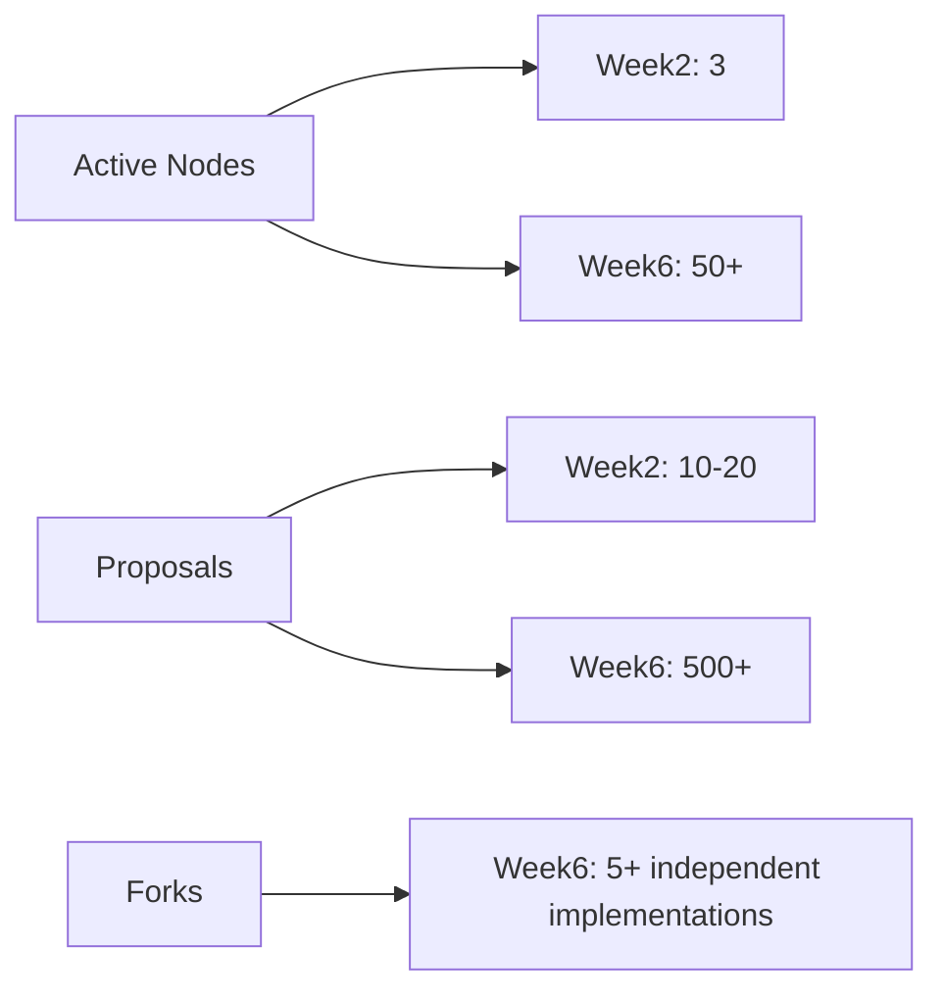

### **EGP Development Roadmap (Weeks 2-6)**  
#### **✨ Week 2: Community Alpha Launch**  
**Goal:** Stress-test with diverse users  
- [ ] **Pilot Program**  
  - Recruit 3 community types:  
    1. **Digital** (DAO, open-source project)  
    2. **Bioregional** (Indigenous council, transition town)  
    3. **Institutional** (City gov sandbox)  
  - Provide:  
    - Docker cheat sheet (`docker run -p 4010:4010 egp-node`)  
    - Postman collection with example flows  
- [ ] **Feedback Channels**  
  - GitHub template: `FEEDBACK.md` with:  
    ```markdown  
    ## What worked?  
    ## What broke?  
    ## Magic moment? (When the protocol surprised you)  
    ```  
  - Weekly "Office Hours" on Discord  

#### **🔧 Week 3: Adaptive Iteration**  
**Goal:** Harden protocol based on alpha feedback  
- [ ] **Patch Hotfixes**  
  - Priority: Fix all `priority:critical` issues from Week 2  
  - Example anticipated fixes:  
    - Timezone handling in `sunset` clauses  
    - DID auth edge cases  
- [ ] **Schema Expansion**  
  - Add `cultural_context` field to proposals:  
    ```yaml  
    cultural_protocol:  
      type: string  
      enum: [consent, majority, elder_council, song_ritual]  
    ```  
- [ ] **DevOps Boost**  
  - Set up GitHub Actions for:  
    - Auto-deploy on `main` pushes  
    - IPFS pinning of test data  

#### **🌐 Week 4: Network Readiness**  
**Goal:** Prepare for decentralized deployment  
- [ ] **Node Networking**  
  - Add libp2p basics:  
    ```javascript  
    import { createLibp2p } from 'libp2p'  
    import { tcp } from '@libp2p/tcp'  
    ```  
  - Document peer discovery process  
- [ ] **Conformance Badge**  
  - Design `EGP-verified` badge (SVG)  
  - Publish criteria:  
    ```markdown  
    - Implements all 3 verbs  
    - Passes 90% of test suite  
    - Publishes data to IPFS  
    ```  
- [ ] **Governance RFC**  
  - Start `GOVERNANCE.md` for protocol changes  
  - First debate: *"Should `sense()` allow anonymous submissions?"*  

#### **🚀 Week 5: Beta Ecosystem**  
**Goal:** Enable third-party integrations  
- [ ] **Client SDKs**  
  - Release alpha packages:  
    ```bash  
    npm install @egp/js-client  
    pip install egp-client  
    ```  
- [ ] **Gateway Network**  
  - Deploy 3 reference nodes:  
    1. **Berlin** (Hetzner)  
    2. **Nairobi** (Equinix)  
    3. **São Paulo** (Community host)  
- [ ] **First Fork**  
  - Document process for:  
    ```bash  
    git clone https://github.com/ggf/egp.git  
    cp .env.example .env  # Customize for local context  
    ```  

#### **🎯 Week 6: Protocol Maturity**  
**Goal:** Declare v1.0 readiness  
- [ ] **Audit & Signatures**  
  - Security audit by:  
    - **Least Authority** (crypto review)  
    - **Traditional Council** (cultural review)  
- [ ] **Documentation Finalization**  
  - Produce:  
    - **Video walkthrough** (Loom)  
    - **Zine-style guide** (PDF)  
    - **Interactive tutorial** (Observable notebook)  
- [ ] **Launch Announcement**  
  - Target publications:  
    - Plurality Forum  
    - The New Stack  
    - Community networks  

---

### **Key Metrics Dashboard**  


---

### **Risk Mitigation Table**  
| Risk | Solution | Owner |  
|------|----------|-------|  
| Low pilot engagement | 1:1 onboarding calls | Community Lead |  
| Schema rigidity | Weekly "Schema Jam" | Dev Team |  
| Node centralization | Incentivize gateways | DevOps |  

---

### **Recommended Immediate Action**  
1. **Draft Pilot Invites** (Sample):  
   ```markdown  
   ## Join the EGP Alpha  
   We need:  
   - 1 DAO using this for governance  
   - 1 Indigenous council testing land protocols  
   - 1 City testing policy experiments  

   Rewards:  
   - Co-authorship in v1.0 paper  
   - Custom EGP node deployment  
   ```  
2. **Create Week 2 Milestone** in GitHub with issues for:  
   - Pilot onboarding docs  
   - Feedback template  

